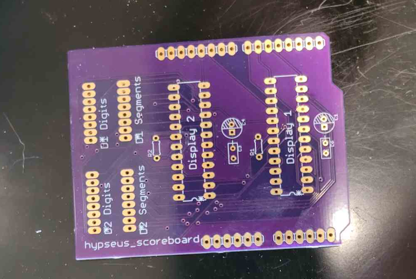
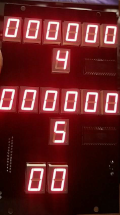
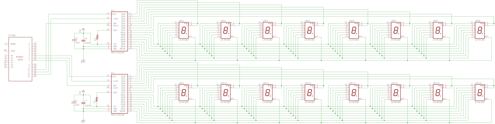
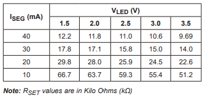
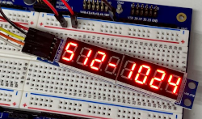
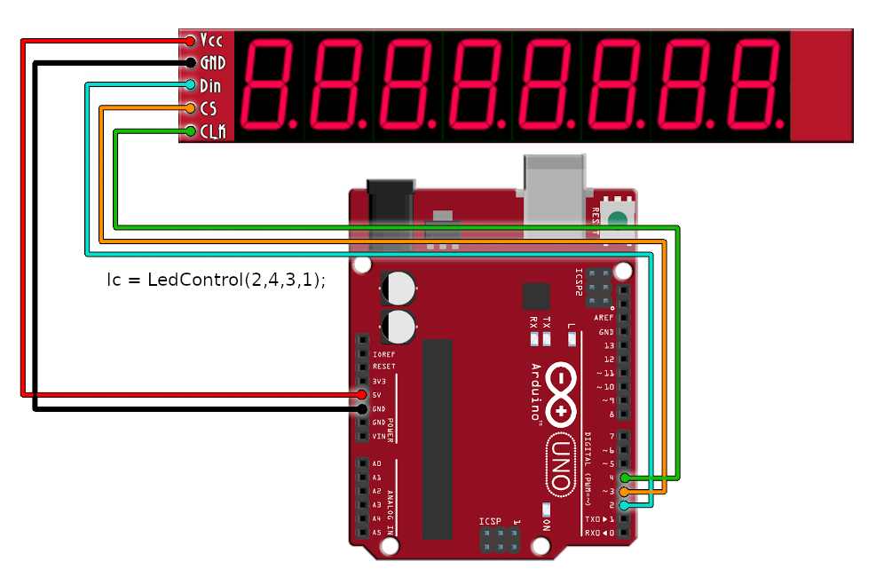

# Dragon's Lair (Arcade) Hardware Scoreboard

This project will provide a repository for information on creating homebrew versions of the _hardware scoreboard_, to operate with the _Don Bluth_ Laserdisc Arcade games `Dragon's Lair`, `Space Ace` and `Thayer's Quest`, using [Hypseus Singe][HS]. Support for a `Space Ace` hardware _annunciator_ is also included. 

## Software

[Hypseus Singe][HS] and an _Arduino_ [sketch](sketches/).  

[Arduino IDE][AI] to load sketch onto Board.  

A Windows _hypseus_ binary with _USB serial_ support is provided in _Releases_.

## Hardware

The project uses serial communication with an _Arduino_ `Uno`, `Nano` or `Mega` driving `MAX7219`  
8-Digit LED Display Controllers to power _7-segment LED_ character, or other _LED_, displays.

The Arduino _sketches_ provided demonstrate the serial communication (_using serialib_) between  
_hypseus_ and the Arduino. These should be portable to other programmable microcontrollers able  
to handle serial communication.

Required Arduino libraries:  
[LEDControl][LED]  
[SerialLib][SL]

### Hardware details and schematics

Easy to construct, it can be hand wired on a basic perfboard with LED sizes of your choosing. Be aware of the power consumption of the LEDs as largers displays will require that an exterior power source be implemented. Components can be _(DIP/DIL)_ through hole to enable easy soldering.

Fabrication files can be found in [schematics](schematics/).  

#### Bill of Materials:

* 1 &nbsp; &nbsp;- &nbsp;_Arduino Microcontroller [IC2]_
* 16 &nbsp;- &nbsp;_7-Segment display **(common cathode)** [LED1 to 16]_
* 2 &nbsp; &nbsp;- &nbsp;_MAX7219 [IC1 & IC3]_ 
* 2 &nbsp; &nbsp;- &nbsp;_100nf capacitor [C6 - C7]_
* 2 &nbsp; &nbsp;- &nbsp;_10uf electrolytic capacitor [C1 - C2]_
* 2 &nbsp; &nbsp;- &nbsp;_Resistor [R1 - R2] value:_  
_See table below:_

### Using prebuilt LED modules

It can also be created using pre-built and commonly available _8-Digit_ `MAX7219` modules:

 

See demonstration videos on image links above.

## Serial protocol

The provided _sketches_ are coded for a `19200` baud rate on the Arduino side.  
_Baud rates_ should be adjusted to give the most reliable communication on your hardware. 

Updates are communicated using a _three byte struct_ using _`writeBytes()`_:

    typedef struct {
       char unit;
       char digit;
       char value;
    } DigitStruct;

 The _scoreboard_ _`DigitStruct.value`_ is _7-bit ASCII_ suitable for passing via _`setChar()`_ as a `(byte)` cast.
 
 The _annunciator_ will recieve _`0`_, _`1`_, _`2`_ or _`4`_ on _`value`_, _`digit`_ is unused.

_Scoreboard:_ `unit` is _`0`_ | _Annunciator:_ `unit` is _`1`_

## Hypseus command arguments

You will need to provide the following arguments to enable serial communication on the required port:

 _(Use 19200 baud for provided sketch)_

_In MS Windows:_

    -usbscoreboard COM <com port decimal> <baud rate>

In _Linux_, the USB device can appear as `USB` or `ACM`. Specify your connection as follows:

    -usbscoreboard ACM <com port decimal> <baud rate>
    -usbscoreboard USB <com port decimal> <baud rate>
    
Example:

    -usbscoreboard COM 3 19200

Ensure that the _hypseus_ user has _read/write_ permission on the _USB_ device.  
Group membership to `dialout` should normally suffice in _linux_.

### Reference
#### WhichDigit enum &nbsp; &nbsp; * DigitStruct('digit')

    typedef enum
    {
          PLAYER1_0 = 0,
          PLAYER1_1,
          PLAYER1_2,
          PLAYER1_3,
          PLAYER1_4,
          PLAYER1_5,
          PLAYER2_0,
          PLAYER2_1,
          PLAYER2_2,
          PLAYER2_3,
          PLAYER2_4,
          PLAYER2_5,
          LIVES0,
          LIVES1,
          CREDITS1_0,
          CREDITS1_1,
          DIGIT_COUNT
    } WhichDigit;

## Community Image Share

Please share images of your projects and creations on the [Hypseus Discord][DIS] server.

## Credits

A massive thanks goes out to [Rumblebelly5][RB5] for the inspiration, patience, schematics, hardware   
itinerary and expertise on this project. Without them this project would not be possible.

## License

**Hypseus Singe**, Being Retro Orientated This Humble Emulator Regenerates  

Copyright (C) 2021-2022  [DirtBagXon][owner]

&nbsp;

This work is licensed under a <a rel="license" href="http://creativecommons.org/licenses/by-nc-sa/4.0/">Creative Commons Attribution-NonCommercial-ShareAlike 4.0 International License</a>.
    
    
## Liability

The user assumes complete responsibility for all hardware used in conjunction with this application. The repository maintainers will not be responsible in any way for the non-performance or malfunction of any hardware used in conjunction with this application, nor for any damages whatsoever arising out of the use of any such hardware.

## Trademark

The "Hypseus Singe" mark is used to uniquely identify this project as an Arcade
Laserdisc Emulator.  __Any direct or indirect commercial use of the mark
"Hypseus" is strictly prohibited without express permission.__

[owner]: https://github.com/DirtBagXon
[RB5]: https://github.com/Rumblebelly5
[HS]: https://github.com/DirtBagXon/hypseus-singe
[DIS]: https://discord.gg/dgCsCfmRfJ
[AI]: https://www.arduino.cc/en/software
[LED]: http://wayoda.github.io/LedControl/pages/software
[SL]: https://lucidar.me/en/serialib/cross-plateform-rs232-serial-library/
[GNU General Public License]: http://www.gnu.org/licenses/gpl-3.0.en.html
